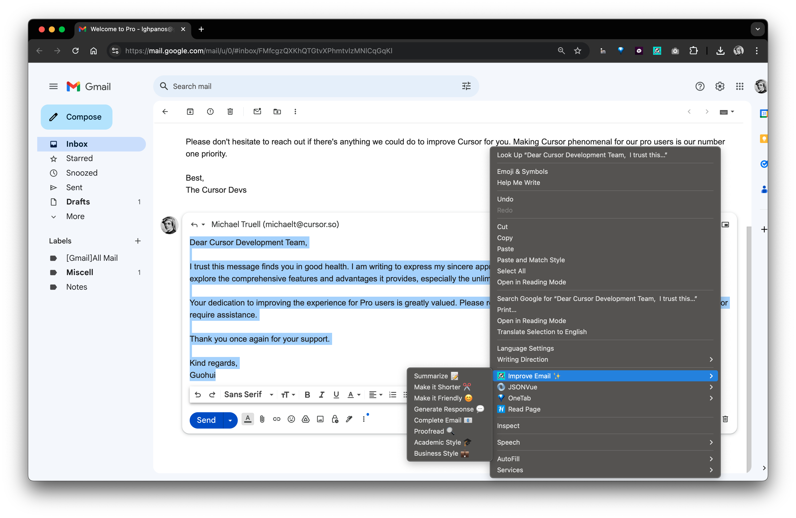
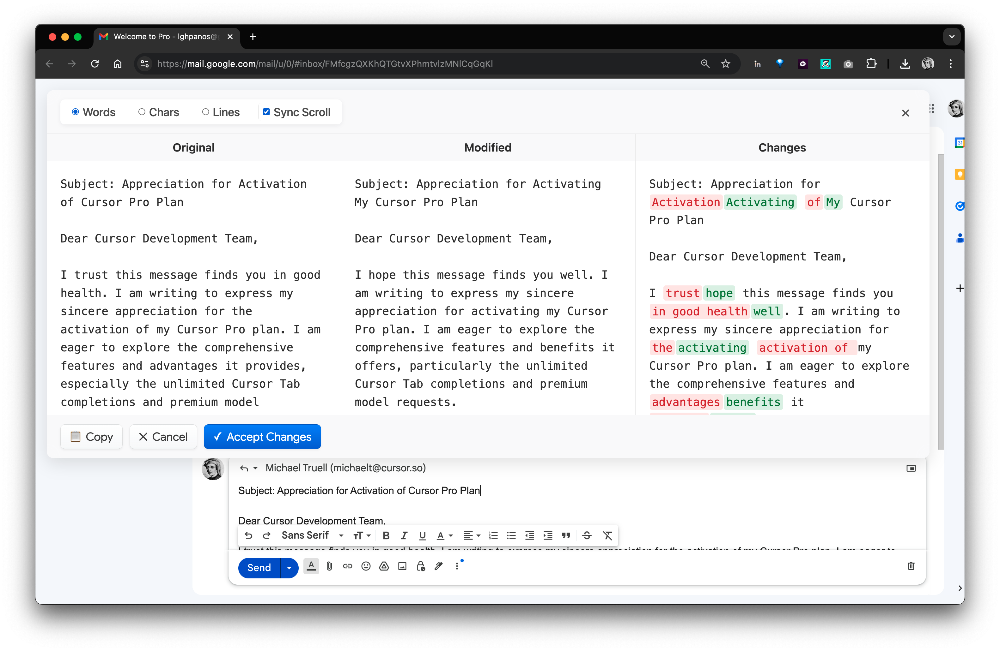
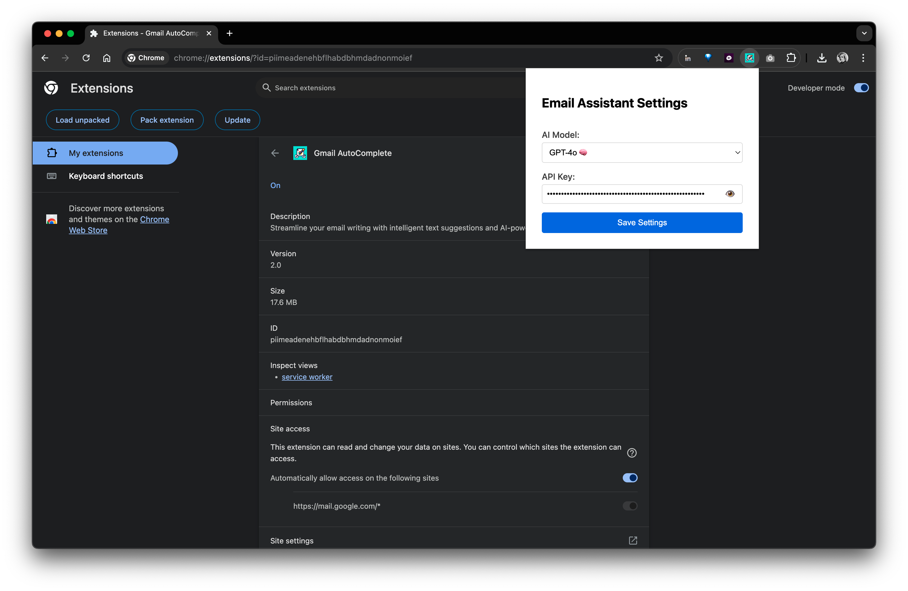
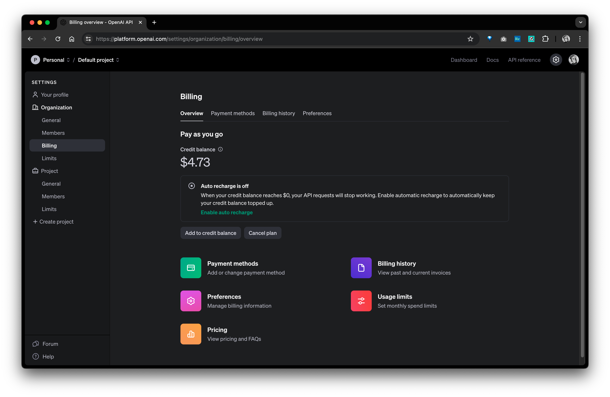
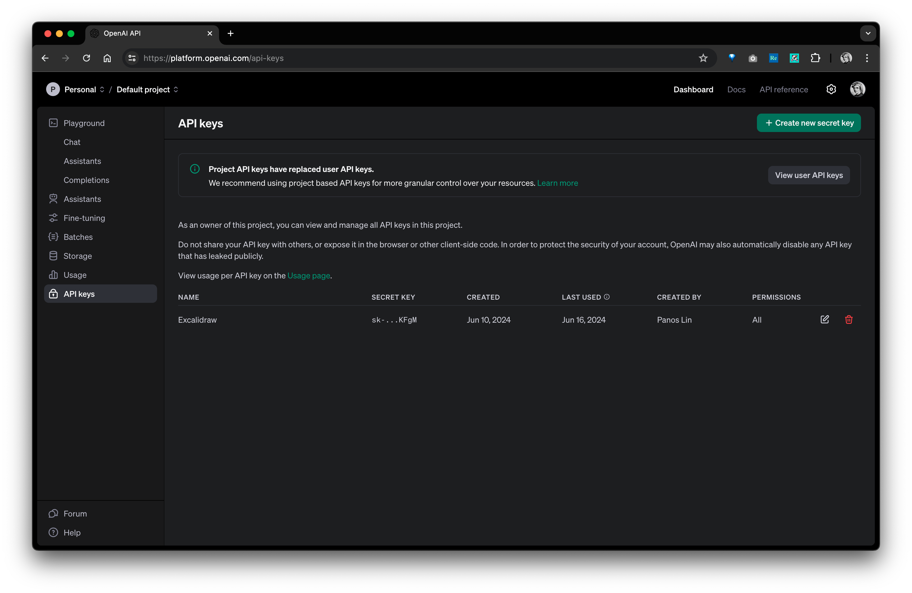

# Gmail Email Assistant Chrome Extension

This Chrome extension enhances your Gmail composing experience by providing intelligent email improvements using various AI models. The extension offers a powerful three-panel diff view to compare and review AI-suggested improvements to your email text.

## Features

- **Multiple AI Models Support**: Choose from various AI models:
  - OpenAI GPT-3.5 Turbo and GPT-4
  - Anthropic Claude 2
  - LLaMA 2
  - Grok 1

- **Smart Email Improvements**:
  - **Summarize** emails 📝
  - Make text **shorter** ✂️
  - Make text more **friendly** 😊
  - Generate **responses** 💬
  - **Complete** emails 📧
  - **Proofread** content 🔍
  - Convert to **academic** style 🎓
  - Convert to **business** style 💼

- **Advanced Diff Comparison**:
  - Three-panel diff view for **easy comparison**
  - Original text, modified text, and changes view
  - Synchronized scrolling option
  - Multiple diff modes (Words/Chars/Lines)
  - Color-coded additions and deletions

- **User-Friendly Interface**:
  - Context menu integration
  - Easy-to-use settings popup
  - Secure API key storage
  - Copy, accept, or cancel changes
  - Toast notifications for errors
  - Loading indicators

## Installation

1. **Install from [Chrome Web Store](https://chromewebstore.google.com/detail/gmail-autocomplete/jpbpagapiifleboecbkfljelpeknlbcl)**

2. **Configure the Extension**:
   - Click the extension icon in Chrome toolbar
   - Enter your API key ([**How to get the token?**](##API-Key-Setup))
   - Select your preferred AI model

   

## Usage

1. **Open Gmail** and compose or reply to an email

2. **Select Text** you want to improve

3. **Right-Click** and choose "Improve Email ✨" from the context menu

4. **Choose Improvement Type**:
   - Summarize
   - Shorten
   - Make Friendly
   - Generate Response
   - Complete Email
   - Proofread
   - Academic Style
   - Business Style

5. **Review Changes** in the three-panel diff view:
   - Left panel: Original text
   - Middle panel: Modified text
   - Right panel: Color-coded changes

6. **Use the Controls**:
   - Toggle synchronized scrolling
   - Switch between diff modes
   - Copy, accept, or cancel changes

## API Key Setup

1. Add credit balance to [OpenAI Platform](https://platform.openai.com/settings/organization/billing/overview) (Minimum $5)

   

2. Create an API Key from [OpenAI Dashboard](https://platform.openai.com/api-keys)

   

3. Enter your API key in the extension settings

   

4. Start improving your emails with AI assistance!

   

## Contributing

We welcome contributions! Please feel free to:
- Open issues for bugs or feature requests
- Submit pull requests with improvements
- Share feedback and suggestions

## License

This project is licensed under the MIT License. See the [LICENSE](https://github.com/panoslin/GmailAutoComplete/blob/main/LICENSE) file for details.

## Contact

For questions, support, or feedback:
- Open an issue on [GitHub](https://github.com/panoslin/GmailAutoComplete/issues)
- Email us at lghpanos@gmail.com

