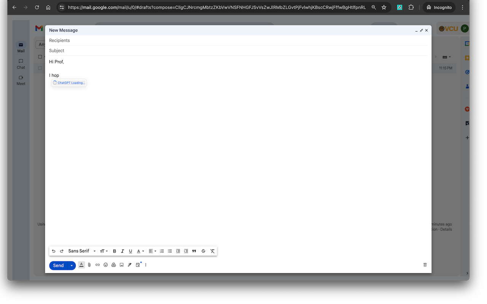
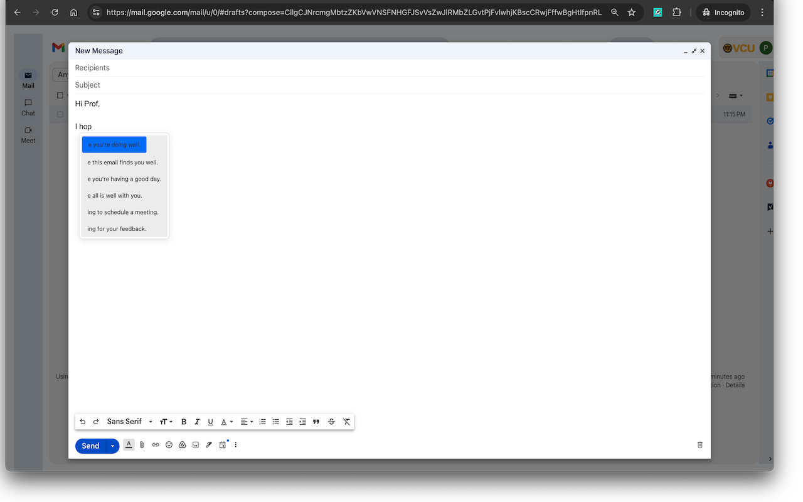
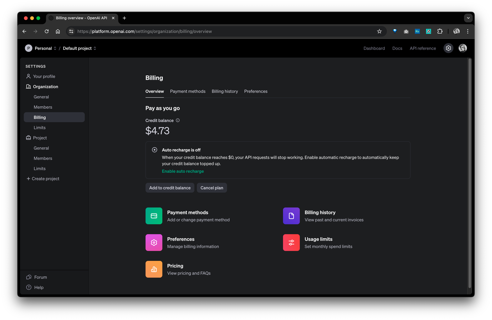
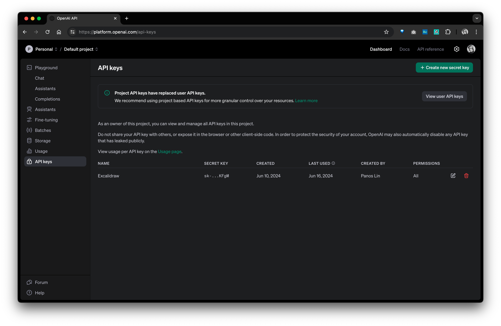
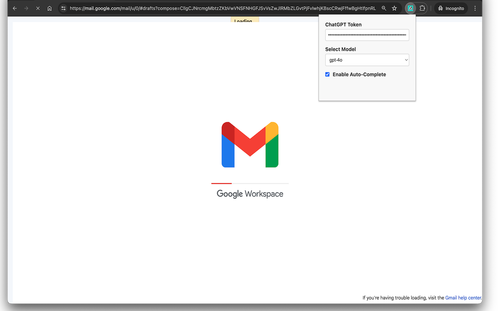

# GmailAutoComplete

An Email Auto-Complete Chrome Extension using ChatGPT most advanced Models

### Demo

## Usage

1. [Add credit balance](https://platform.openai.com/settings/organization/billing/overview) to ChatGPT if not yet (At least $5)

	

2. Create a ChatGPT API Key from [this page](https://platform.openai.com/api-keys)

	

3. Paste your API token to the extension's popup menu, select your preferred model and enable the Auto-Complete

	

4. Enjoy the ChatGPT-Powered Email Auto-Completion.

	

