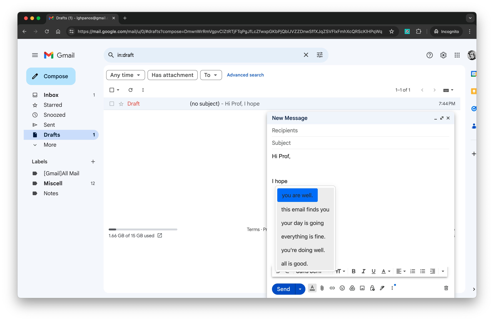
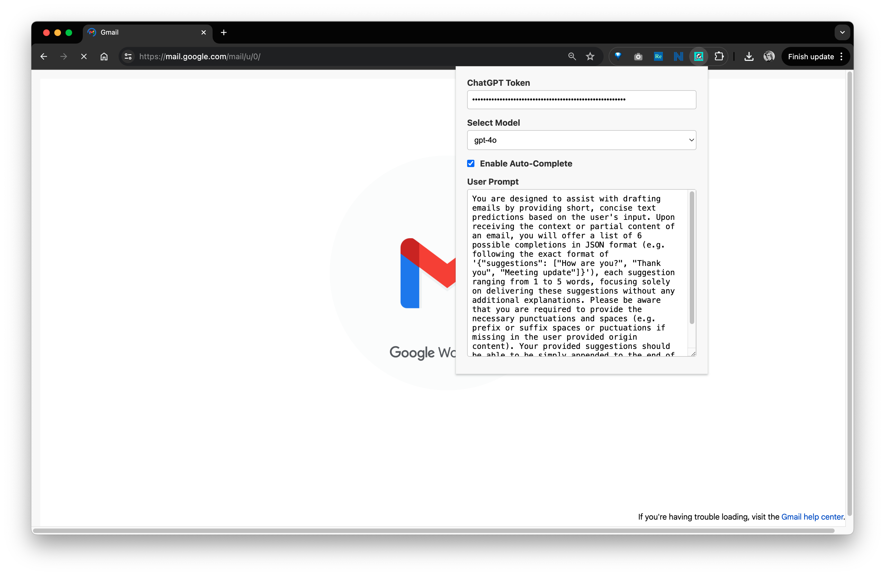
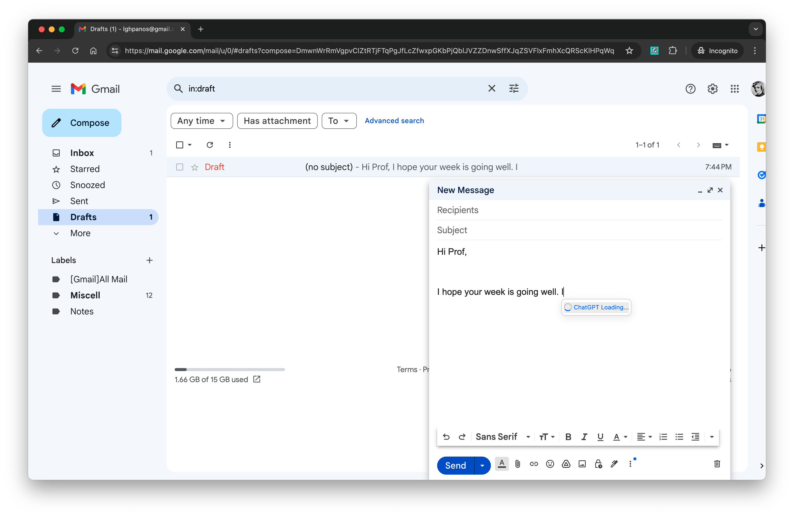

# Gmail Auto-Complete Chrome Extension

This Chrome extension enhances your Gmail composing experience by providing intelligent auto-complete suggestions using OpenAI's ChatGPT. The extension offers short, concise text predictions based on your input, helping you draft emails more efficiently.



## Features

- **API Token Storage**: Securely store your ChatGPT API token completely locally.
- **Model Selection**: Choose between `gpt-3.5-turbo` and `gpt-4o`.
- **User Prompt Configuration**: Customize the prompt sent to ChatGPT.


## Usage

1. **Install extension from [Chrome Web Store](https://chromewebstore.google.com/detail/gmail-autocomplete/jpbpagapiifleboecbkfljelpeknlbcl)**

   

   

2. **Open the Extension**

   - Click on the extension icon in the Chrome toolbar to open the settings popup.

   	

3. **Configure Settings**

   - **ChatGPT Token**: Enter your ChatGPT API token. This token is required for the extension to communicate with the OpenAI API. ([**How to get the token?**](#Create-ChatGPT-API-Token))

   - **Select Model**: Choose your preferred ChatGPT model (`gpt-3.5-turbo` or `gpt-4o`).

   - **Enable Auto-Complete**: Toggle the auto-complete functionality on or off.

   - **User Prompt**: Customize the prompt sent to ChatGPT. The default prompt is:
     
     ```tex
     You are designed to assist with drafting emails by providing short, concise text predictions based on the user's input. Upon receiving the context or partial content of an email, you will offer a list of 6 possible completions in JSON format (e.g. following the exact format of '{"suggestions": ["How are you?", "Thank you", "Meeting update"]}'), each suggestion ranging from 1 to 5 words, focusing solely on delivering these suggestions without any additional explanations. Please be aware that you are required to provide the necessary punctuations and spaces (e.g. prefix or suffix spaces if missing in the origin text). Your suggestions should be able to simply append to the end of the origin text.
     ```
     
     

4. **Compose an Email**

   - Open [Gmail](gmail.com) and start composing an email. The extension will provide auto-complete suggestions as you type based on the configured settings.

## Create ChatGPT API Token

1. Add credit balance to [ChatGPT](https://platform.openai.com/settings/organization/billing/overview) if not yet (At least $5)

	

2. Create a ChatGPT API Key from [the dashboard](https://platform.openai.com/api-keys)

	

3. Paste your API token to the extension's popup menu.

	

4. Enjoy the ChatGPT-Powered Email Auto-Completion.

	

	


## Contributing

We welcome contributions! Please open an issue or submit a pull request for any changes or enhancements.

## License

This project is licensed under the MIT License. See the [LICENSE](https://github.com/panoslin/GmailAutoComplete/blob/main/LICENSE) file for details.

## Contact

For any questions or support, please open an issue on the [GitHub repository](https://github.com/panoslin/GmailAutoComplete/issues) or contact us directly at lghpanos@gmail.com.

